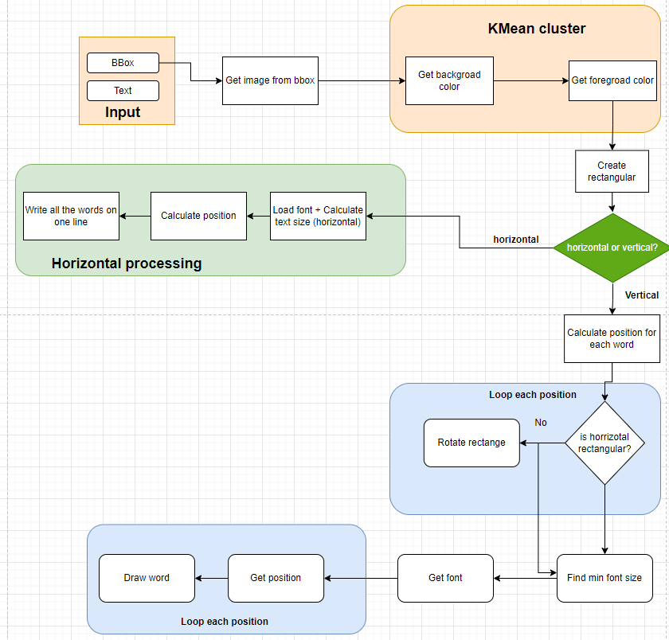

<!-- # Scene Text Recognition
[](https://colab.research.google.com/drive/1BHbTpH1p2AQoqsexOa8nIFXn7q_l-MKS?usp=sharing) -->

[Try Demo on our website](https://str-vietnam-temple.vercel.app)
## What's new


- 27 September 2023 - Version 0.4
    - Rotate the text according to the rotation angle of the bbox.
    - Change the method for determining background and foreground colors.
    - Add time to inference.
    - Add code to run on [Google Colab](https://colab.research.google.com/drive/1BHbTpH1p2AQoqsexOa8nIFXn7q_l-MKS?usp=sharing)
    - [Report](https://drive.google.com/file/d/1kZxKnXpIywnqi4kAFb-roqLnbHNgTs3J/view?usp=sharing)
    - [Web](https://tools.clc.hcmus.edu.vn/)
    - [Output](https://drive.google.com/drive/folders/1XYETIJ9BbKvX-RRxP_wOsFIIW137mP4Y?usp=drive_link)

- 11 September 2023 - Version 0.3
    - Skip Latin characters.
    - Expand bounding box following by polygons instead in rectangles

- 22 August 2023 - Version 0.2
    - Integrate OCR into the pipeline
    - Recognition for vertical texts.
    - Postprocessing for vertical texts.
    

- 11 August 2023 - Version 0.1
    - Code fullflow for STR Chinese Temples.
    - Code backend and fronents for demo.
    - Code postprocessing for final output.

## What's coming next
- Write log
- Add debug code
- Add translations Han- Vietnamese
- Rotate image before process
- Remove text
- Classify style -> Define vietnamese's font
- Mapping color.
- [What is real image in Vietnamese?](https://xaydungso.vn/noi-that/top-50-mau-cong-chua-dep-hien-dai-nhat-vi-cb.html)
-> Increment height of text
- Collect data temple in vietnamese.
- Train more accurate model detection and recognition text
- Collect and label datasets.
- Host on server have GPU.
- Add XAI support
- Add illustration video like 3Blue1Brown
- Write thesis
- Write paper
- Multimodel for STR
## Todo
### GUI
- Show time to inference
- Format log file
- Delete unnecessary information

### Backend
1. Host on server


## Input and output
### Input

### Output


## Installation
Install using `pip`
``` bash
pip install -r requirements.txt
```
### To use PP-OCR method
1. Download wheel PyMuPDF from [GG Drive](https://drive.google.com/file/d/1bYdtLr2tkyWZJr-TBSO8MB6w-BZTxkaG/view?usp=drive_link)
2. Install PyMuPDF
```sh
pip install PyMuPDF-1.20.2-cp311-cp311-win_amd64.whl
```
3. Install PaddleOCR
```sh
pip install paddleocr
```
### Install in Azure server
1. Install paddlepaddle
- Without GPU

``sh 
python -m pip install paddlepaddle -i https://pypi.tuna.tsinghua.edu.cn/simple
``
- With GPU
``sh
python -m pip install paddlepaddle-gpu -i https://pypi.tuna.tsinghua.edu.cn/simple
``
SRC: https://github.com/PaddlePaddle/PaddleOCR/blob/release/2.7/doc/doc_en/quickstart_en.md

2. Install paddleocr
``sh
pip install "paddleocr>=2.0.1" --upgrade PyMuPDF==1.21.1
``
Thanks: https://stackoverflow.com/questions/76379293/how-can-i-fix-the-error-in-pymupdf-when-installing-paddleocr-with-pip

3. Install sklearn
``sh
pip install scikit-learn
``
4. Update libgomp1
``sh
apt-get install libgomp1
``
Thanks: https://stackoverflow.com/questions/43764624/importerror-libgomp-so-1-cannot-open-shared-object-file-no-such-file-or-direc

5. Update ffmpeg libsm6 libxext6 library
``sh
apt-get update && apt-get install ffmpeg libsm6 libxext6  -y
``
Thanks: https://stackoverflow.com/questions/55313610/importerror-libgl-so-1-cannot-open-shared-object-file-no-such-file-or-directo

## Run code
Change input and output path in `run.sh`. Then run this command:
``` bash
sh run.sh
```

## Run demo
### Run backend
``` bash
flask run
```
### Run frontend
Double click `frontend.html` to run the frontend.


## Log
We write log in folder  `log`. Each log file will contain the log message every day.

## Fullflow diagram


### Postprocessing


### Preprocessing

### OCR
#### Text Detection


#### Text Recognition


## Dataset
### Synthesis


### Reality


### Label

## Language Model

## Translate from accent Vietnamese to modern Vietnamese


## Documentation


## References
